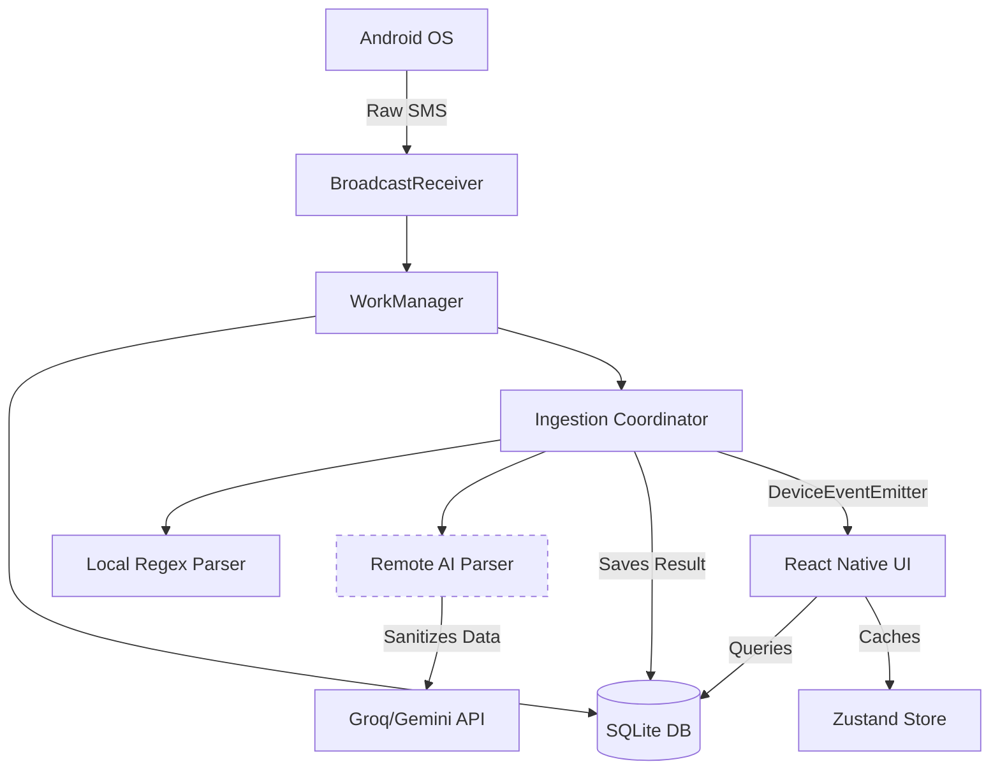

# Architecture Spine — TrackMoney

## Design Paradigm

**Local-First / Event-Driven**. 
The device's local database (SQLite) is the absolute source of truth. Background services mutate data independently of the UI lifecycle and signal the UI to refresh via a global event bus (`DeviceEventEmitter`).

## Inherited Invariants

| Inherited | From parent | Binds here |
| --- | --- | --- |
| Compliance constraints | AGENTS.md | Background service transience (`stopSelf()`), no `RECEIVE_BOOT_COMPLETED`, 10s AI timeout. |

## Invariants & Rules



### AD-1 — SQLite Absolute Source of Truth
- **Binds:** `UI State Management`, `Background Tasks`
- **Prevents:** Stale data bugs, UI-background sync races, data loss on app kill.
- **Rule:** SQLite is the absolute source of truth. Zustand acts exclusively as an ephemeral read-cache and UI state container (e.g., drafts). The UI must never accept transaction data directly from background event payloads; it must re-query SQLite upon receiving a refresh signal.

### AD-2 — Pure Parser Boundaries
- **Binds:** `SMS Parsing Pipeline`
- **Prevents:** Tightly coupled parsing logic that is impossible to unit test or swap out.
- **Rule:** Parsers (Regex and AI) are strict pure functions. They take a raw string and return a standardized object. They have zero database access. A separate Coordinator handles database operations like merchant lookups and transaction persistence.

### AD-3 — Interface-Driven AI with Remote Masking
- **Binds:** `AI Parsing Layer`
- **Prevents:** Leaking sensitive PII over the network, while keeping the architecture open for future on-device SLMs (e.g., Gemma).
- **Rule:** The Coordinator passes raw SMS data to a generic Parser interface. Masking/redaction of sensitive PII (like account numbers) is the strict responsibility of Remote implementations (Groq/Gemini) *before* network transit. Future Local/On-device implementations are permitted to bypass masking.

## Consistency Conventions

| Concern | Convention |
| --- | --- |
| Async Fallback | AI calls must return `SUCCESS` to WorkManager even on parse failure (with `NEEDS_REVIEW` flag) to prevent infinite retries. |
| Timeouts | All remote AI calls enforce a strict 10-second timeout. |

## Stack

| Name | Version |
| --- | --- |
| React Native / Expo | SDK 54 |
| Drizzle ORM | ^0.45.1 |
| SQLite | expo-sqlite ~16.0.10 |
| Zustand | ^5.0.12 |

## Structural Seed

```text
/
  app/            # UI Routes (React Native UI tree)
  db/             # SQLite / Drizzle schemas and queries
  store/          # Zustand ephemeral state and read-caches
  lib/sms/        # Pure parsers and the Ingestion Coordinator
  android/        # Custom Native Android Services (BroadcastReceiver, Headless JS)
```

## Deferred

- **On-Device SLM (Gemma) Integration:** Deferred until hardware constraints and local model capabilities on standard Android devices are verified. The interface boundary (AD-3) is prepared for it.
